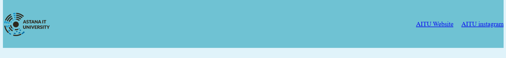
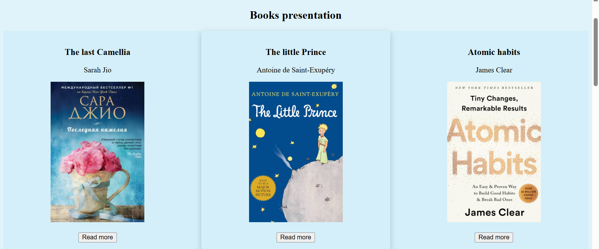
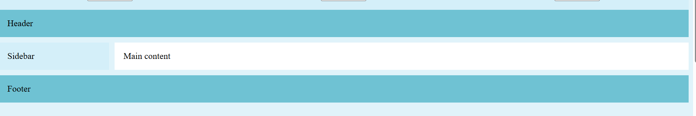
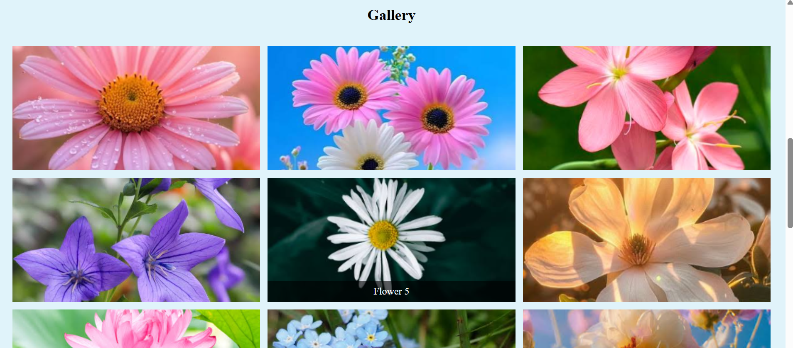
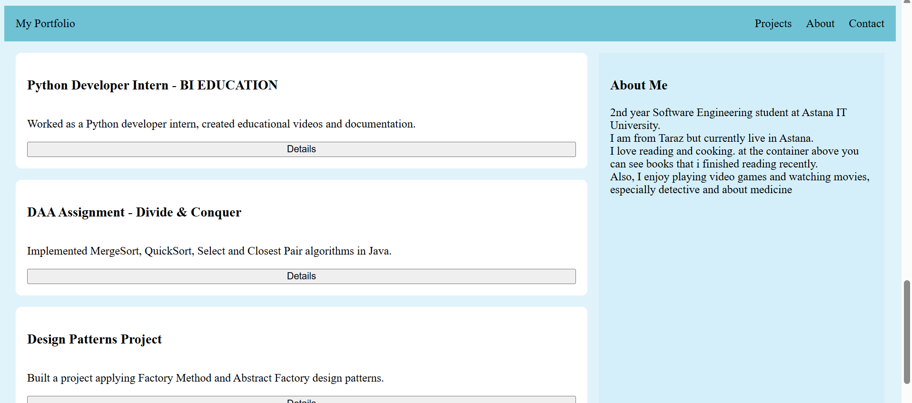

# Assignment 2. Advanced CSS (Flexbox & Grid)

Name: Gulim Zhumabay

Group: SE-2539

## Overview

This project is a personal webpage built for Assignment 2. The goal was to practice advanced CSS layout using Flexbox and CSS Grid. The page combines several sections, each showing a different layout technique, and ends with a portfolio page that includes both.

## Task 0. Navigation Bar

Created a header section with a logo on the left and a list of links to official site and instagram on the right. The header is a flex container, the logo and links are aligned horizontally and centered vertically, and spacing between the links is done with flexbox gap.

## Task 1. Card Row

Created a container with three cards, each with an image(book cover), title(name of the book), text(author) and button.  The container is a flex container so the cards sit in a row, they have equal height, gaps between them, and a hover effect.

## Task 2. Page Layout with Grid Areas

Built a layout with header, sidebar, main content and footer using CSS Grid. The parent container is a grid container with defined rows and columns, and grid areas are assigned so the header spans the top, sidebar is on the left, main content is on the right, and footer spans the bottom.

## Task 3. Image Gallery

Collected 9 images of flowers and placed them in a gallery container. The gallery is a grid container with 3 equal width columns, gaps between images, and a hover effect that shows a caption when hovering over an image.

## Task 4. Portfolio Page

Built a portfolio page combining flexbox and grid. The header uses flexbox for the navigation bar. The main section uses CSS Grid, with a projects area on the left and an about/info section on the right. Inside each project card I used flexbox to arrange the title, description and button. The footer takes up the full width and has my contact links.

## Work Process Summary

I started with the easier tasks first, the navbar and the cards, to get used to flexbox properties like display, justify-content, align-items and gap. Then I did the page layout and the image gallery with CSS Grid, using grid-template-columns, grid-template-rows and grid-template-areas. For the gallery hover captions I used position: absolute inside a container with position: relative, and changed the opacity to show the caption on hover. In the last task I put together everything from before into one portfolio page, using flexbox for the navigation and the cards, and grid for the overall layout.